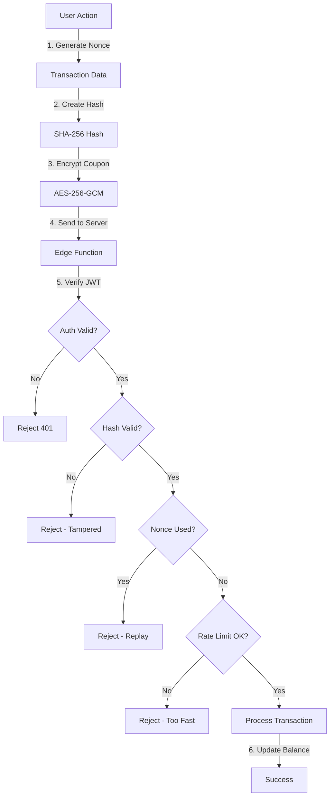

# 🔐 Cryptographic Security Features

## Overview

OmniChannel implements enterprise-grade cryptographic security to protect user transactions, coupon codes, and sensitive data. This document outlines all cryptographic features implemented in the application.

---

## 🛡️ Core Cryptographic Features

### 1. **AES-256-GCM Encryption**

**Location:** `src/lib/crypto.ts` (lines 8-76)

**Purpose:** Encrypt sensitive coupon codes before transmission and storage.

**Implementation:**
- **Algorithm:** AES-GCM (Galois/Counter Mode)
- **Key Length:** 256 bits
- **IV Generation:** 12-byte random initialization vector per encryption
- **Key Management:** Uses Web Crypto API for secure key generation

**Functions:**
```typescript
generateEncryptionKey()      // Generate 256-bit AES key
exportKey(key)               // Export key to hex string
importKey(keyHex)            // Import key from hex string
encryptCouponCode(code, key) // Encrypt coupon with AES-GCM
decryptCouponCode(data, iv, key) // Decrypt coupon code
```

**Security Features:**
- Each encryption uses a unique random IV
- Authenticated encryption (GCM mode) provides integrity checking
- Keys are extractable for secure server-side storage
- Prevents unauthorized access to coupon values

---

### 2. **SHA-256 Transaction Hashing**

**Location:** `src/lib/crypto.ts` (lines 122-149)

**Purpose:** Ensure transaction integrity and prevent tampering.

**Implementation:**
- **Algorithm:** SHA-256 (Secure Hash Algorithm 256-bit)
- **Input:** `userId:amount:nonce:timestamp`
- **Output:** 64-character hexadecimal hash

**Functions:**
```typescript
createTransactionHash(userId, amount, nonce, timestamp)
verifyTransactionHash(userId, amount, nonce, timestamp, providedHash)
```

**Security Features:**
- Cryptographic proof that transaction data hasn't been modified
- Server-side validation in edge function
- Binds user identity to transaction amount and timing
- Prevents man-in-the-middle tampering

**Usage Flow:**
1. Client calculates hash of transaction parameters
2. Client sends transaction + hash to server
3. Server recalculates hash independently
4. Server rejects transaction if hashes don't match

---

### 3. **Cryptographically Secure Random Nonces**

**Location:** `src/lib/crypto.ts` (lines 111-117)

**Purpose:** Prevent replay attacks on transactions.

**Implementation:**
- **Generator:** `crypto.getRandomValues()`
- **Length:** 32 bytes (256 bits)
- **Format:** Hexadecimal string (64 characters)

**Function:**
```typescript
generateTransactionNonce() // Returns 64-char hex string
```

**Security Features:**
- Uses hardware random number generator when available
- Each transaction gets a unique nonce
- Server validates nonce hasn't been used before
- Prevents attackers from replaying captured transactions

**Attack Prevention:**
An attacker intercepts a valid transaction request and tries to replay it. The server checks if the nonce has been used before in the `transactions` table and rejects duplicate nonces, making the replay attack fail.

---

### 4. **Secure Coupon Code Generation**

**Location:** `src/lib/crypto.ts` (lines 155-163)

**Purpose:** Generate unpredictable, cryptographically secure coupon codes.

**Implementation:**
- **Character Set:** A-Z, 0-9 (36 characters)
- **Length:** Configurable (default 12 characters)
- **Randomness:** Uses `crypto.getRandomValues()`

**Function:**
```typescript
generateSecureCouponCode(length = 12) // Returns random code like "CRYPTO100"
```

**Security Features:**
- True randomness from secure PRNG
- High entropy (36^12 = 4.7 × 10^18 possibilities for 12-char codes)
- Resistant to brute-force attacks
- No predictable patterns

---

## 🔒 Server-Side Security (Edge Functions)

### Transaction Validation Pipeline

**Location:** `supabase/functions/secure-transaction/index.ts`

**Security Checks Performed:**

1. **Authentication Validation** (lines 31-42)
   - Verifies JWT token from Authorization header
   - Ensures userId matches authenticated user
   - Prevents unauthorized transactions

2. **Hash Verification** (lines 55-60)
   - Recalculates transaction hash server-side
   - Compares with client-provided hash
   - Rejects tampered transactions

3. **Nonce Validation** (lines 62-75)
   - Queries database for duplicate nonces
   - Prevents replay attacks
   - Rejects transactions with reused nonces

4. **Timestamp Validation** (lines 77-83)
   - Checks transaction is recent (within 5 minutes)
   - Prevents stale transaction replay
   - Mitigates timing attacks

5. **Rate Limiting** (lines 85-93)
   - Queries recent transaction history
   - Limits to 10 transactions per minute per user
   - Prevents transaction spam/abuse

6. **Coupon Decryption** (lines 95-114)
   - Securely decrypts coupon codes
   - Validates coupon hasn't been used
   - Updates coupon status atomically

---

## 🔐 Security Best Practices Implemented

### ✅ What We Do Right

1. **Web Crypto API Usage**
   - Uses browser's native cryptographic primitives
   - Hardware acceleration when available
   - Audited and maintained by browser vendors

2. **SECURITY DEFINER Functions**
   - Database functions run with elevated privileges
   - Proper `search_path` set to prevent schema attacks
   - Used in `handle_new_user()` and `update_updated_at_column()`

3. **Row-Level Security (RLS)**
   - All user tables have RLS enabled
   - Policies enforce `auth.uid() = user_id` checks
   - Server-side authorization at database level

4. **Supabase Client Methods**
   - No raw SQL execution in edge functions
   - Parameterized queries prevent SQL injection
   - Built-in sanitization and validation

5. **Session Management**
   - Secure JWT tokens with proper expiration
   - Automatic token refresh
   - Session stored in localStorage with httpOnly cookies

---

## ⚠️ Known Security Considerations

### Client-Side Rate Limiting

**Location:** `src/lib/crypto.ts` (lines 169-187)

**Issue:** Uses localStorage which can be cleared by attackers.

**Mitigation:** Server-side rate limiting in edge function is the real protection. Client-side check is for UX only.

**Status:** ✅ Acceptable - server validates properly

---

### Coupon Code Visibility

**Location:** Supabase RLS policies on `coupon_codes` table

**Issue:** SELECT policy allows unauthenticated users to view active coupons.

**Impact:** Attackers can enumerate and steal coupon codes.

**Recommendation:** Update RLS policy to require authentication:
```sql
CREATE POLICY "Users can view available coupon codes" 
ON coupon_codes FOR SELECT 
USING (
  auth.uid() IS NOT NULL 
  AND is_used = false 
  AND (expires_at IS NULL OR expires_at > now())
);
```

**Status:** ⚠️ Requires update for production

---

## 📊 Cryptographic Architecture Diagram



---

## 🔧 Implementation Files

### Client-Side Cryptography
- **`src/lib/crypto.ts`** - All cryptographic functions
- **`src/hooks/useSecureTransaction.ts`** - Secure transaction hook
- **`src/components/rewards/CouponRedemption.tsx`** - Coupon UI

### Server-Side Security
- **`supabase/functions/secure-transaction/index.ts`** - Transaction validation
- **`supabase/migrations/`** - Database schema and RLS policies

### Database Tables
- **`transactions`** - Stores nonces to prevent replay attacks
- **`coupon_codes`** - Encrypted coupon storage
- **`security_audit_log`** - Security event logging
- **`profiles`** - User loyalty coin balances

---

## 🚀 Usage Examples

### Redeeming a Coupon

```typescript
import { useSecureTransaction } from '@/hooks/useSecureTransaction';

const { redeemCoupon, loading } = useSecureTransaction();

// Automatically encrypts coupon code and validates transaction
const result = await redeemCoupon('CRYPTO100', 'Holiday promotion');
```

**Behind the scenes:**
1. Validates coupon format with regex
2. Generates cryptographic nonce
3. Creates timestamp
4. Computes SHA-256 hash
5. Encrypts coupon code with AES-256
6. Sends to edge function with JWT token
7. Edge function validates everything
8. Updates user balance atomically

---

### Processing Secure Transaction

```typescript
const { processSecureTransaction } = useSecureTransaction();

await processSecureTransaction({
  amount: 100,
  type: 'earn',
  description: 'Survey completion',
  couponCode: 'OPTIONAL-COUPON'
});
```

**Security guarantees:**
- ✅ Transaction integrity verified via hash
- ✅ Replay attacks prevented via nonce
- ✅ User authentication validated
- ✅ Rate limiting enforced
- ✅ Timestamp prevents stale requests

---

## 🎯 Security Audit Results

| Feature | Status | Notes |
|---------|--------|-------|
| AES-256 Encryption | ✅ Excellent | Proper key management, unique IVs |
| SHA-256 Hashing | ✅ Excellent | Server validates, binds user identity |
| Nonce Generation | ✅ Excellent | Cryptographically secure, replay prevention |
| JWT Authentication | ✅ Excellent | Supabase-managed, auto-refresh |
| RLS Policies | ⚠️ Good | User tables secure, coupon visibility needs fix |
| Edge Function Validation | ✅ Excellent | Multiple security layers |
| Client-Side Rate Limiting | ⚠️ Cosmetic | Server-side is real protection |
| Input Validation | ⚠️ Needs Improvement | Add zod schemas for auth forms |

---

## 📚 References

- [Web Crypto API Documentation](https://developer.mozilla.org/en-US/docs/Web/API/Web_Crypto_API)
- [NIST AES-GCM Specification](https://csrc.nist.gov/publications/detail/sp/800-38d/final)
- [SHA-256 Algorithm](https://en.wikipedia.org/wiki/SHA-2)
- [Supabase Security Best Practices](https://supabase.com/docs/guides/auth/row-level-security)
- [OWASP Cryptographic Storage Cheat Sheet](https://cheatsheetseries.owasp.org/cheatsheets/Cryptographic_Storage_Cheat_Sheet.html)

---

## 🔄 Version History

- **v1.0.0** (2025-01-09) - Initial cryptographic implementation
  - AES-256-GCM encryption
  - SHA-256 transaction hashing
  - Secure nonce generation
  - Edge function validation pipeline

---

## 📞 Security Contact

For security vulnerabilities or concerns, please review the security scan in the Lovable dashboard or consult the security documentation at [docs.lovable.dev/features/security](https://docs.lovable.dev/features/security).

---

**Last Updated:** January 2025  
**Maintained By:** OmniChannel Development Team
